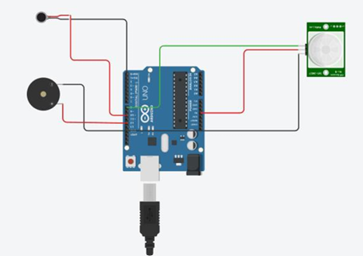
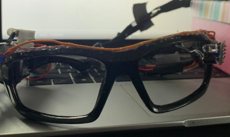
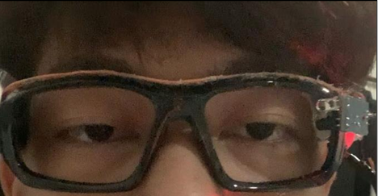
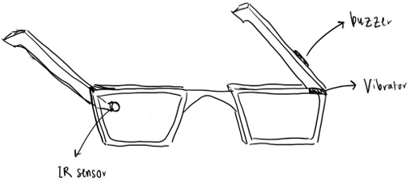
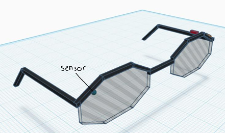
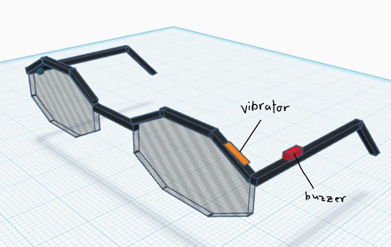
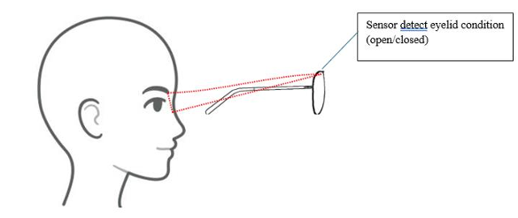
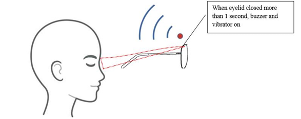

# 👓 Smart Eyeglasses for Driving Safety

> An embedded anti-microsleep system designed to detect prolonged eye closure and alert drivers through vibration and sound.

---

## 🚗 Project Overview

**Smart Eyeglasses** is an embedded safety system developed to help reduce the risk of drowsy driving and microsleep.

The system uses an **IR sensor** to monitor the driver's eyelid condition. When prolonged eye closure is detected, the system activates a **vibration motor** and **buzzer** to alert the driver and regain their attention.

The prototype was developed using an **Arduino Uno** as the main microcontroller.

---

## 🔧 Hardware

| Component | Function |
|---|---|
| **Arduino Uno** | Main microcontroller |
| **IR Sensor** | Detects eyelid condition |
| **Vibration Motor** | Provides tactile alert |
| **Buzzer** | Provides audible alert |
| **Eyeglasses Frame** | Wearable platform |

---

## 💻 Technologies

- **Arduino**
- **Embedded C/C++**
- **IR Sensing**
- **Digital Input/Output**
- **Embedded Systems**
- **TinkerCAD**

---

## 🧠 How It Works

1. The **IR sensor** monitors the driver's eyelid condition.
2. The sensor sends the signal to the **Arduino Uno**.
3. The Arduino processes the sensor input.
4. When prolonged eye closure is detected:
   - 📳 The vibration motor is activated.
   - 🔊 The buzzer is activated.
5. The combined alerts are intended to regain the driver's attention.

---

## 🔌 Circuit Design

The prototype circuit was simulated using **TinkerCAD** before the physical implementation.

  

---

## 🛠️ Physical Prototype

The prototype integrates the **IR sensor, Arduino-based control system, buzzer, and vibration motor** onto an eyeglasses frame.

  

---

## 👁️ System Testing

### Eyes Open

When the driver's eyes are open, the system remains inactive and the alert outputs are not triggered.

  

### Eyes Closed

When prolonged eye closure is detected, the IR sensor triggers the alert mechanism.

  

---

## 🎨 Product Design

### 2D Design

  

### 3D Design

  

  

### Storyboard

  

  

---

## 📊 Key Features

### 👁️ Eyelid Monitoring

The IR sensor is used to monitor the driver's eyelid condition and detect prolonged eye closure.

### 📳 Vibration Alert

The vibration motor provides tactile feedback when the system detects prolonged eye closure.

### 🔊 Audible Alert

The buzzer provides an audible warning to regain the driver's attention.

### 👓 Wearable Design

The electronic components are integrated onto an eyeglasses frame to create a wearable safety device.

### ⚡ Embedded Control

The Arduino Uno processes the sensor input and controls the alert outputs.

---

## 🏆 Achievement

### 🥇 Gold Award — i-RiSE 2025

**Smart Eyeglasses for Driving Safety**

The project was developed as a group engineering project at **Universiti Teknologi MARA (UiTM)**.

---

## 👥 Project Information

| Category | Details |
|---|---|
| **Project** | Smart Eyeglasses for Driving Safety |
| **Product Concept** | SmartLENS |
| **Institution** | Universiti Teknologi MARA (UiTM) |
| **Course** | ENT600 — Technology Entrepreneurship |
| **Project Type** | Group Engineering Project |

---
